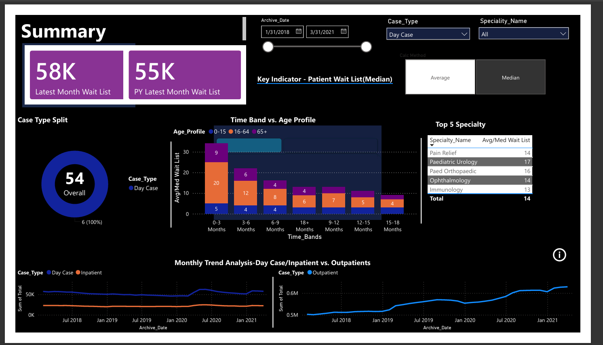
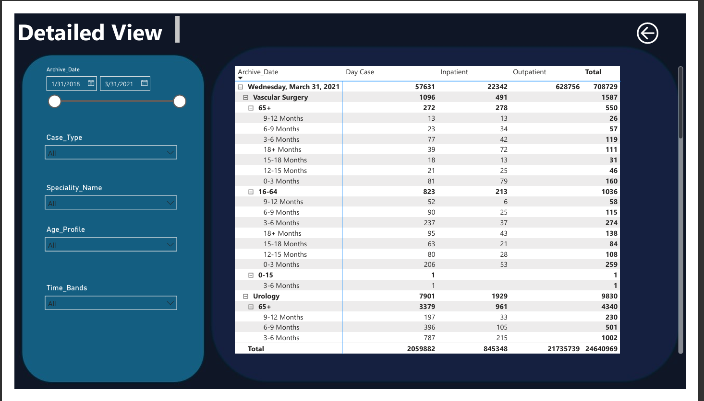
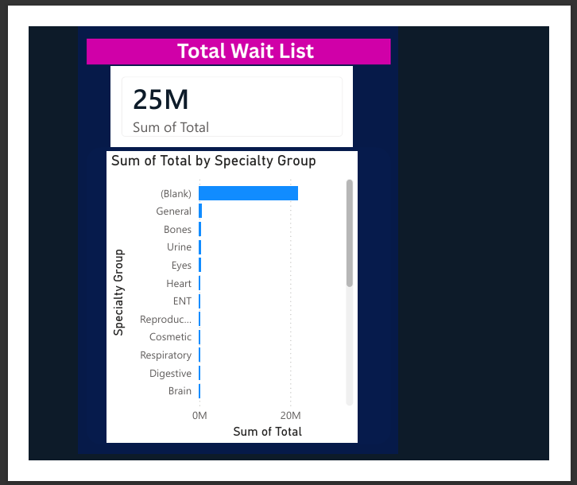

# 🏥 Health Care Waitlist Dashboard

## 📊 Project Overview

The **Health Care Waitlist Dashboard** is an interactive **Power BI Business Intelligence project** developed to analyze and visualize patient waiting list data across different healthcare specialties, case types, age groups, and time periods.

The dashboard transforms raw healthcare data into meaningful insights, enabling hospital administrators and decision-makers to monitor patient demand, identify bottlenecks, and improve resource allocation.

---

# 🎯 Business Problem

Healthcare organizations often face challenges in monitoring large volumes of patient waitlist data spread across multiple departments and years.

Without centralized reporting:

- Difficult to identify specialties with high waiting times
- Hard to monitor inpatient and outpatient trends
- Limited visibility into monthly performance
- Slow decision-making due to manual reporting

This project addresses these issues by providing a centralized and interactive dashboard for healthcare analytics.

---

# 🚀 Project Objectives

- Analyze healthcare waitlist data from multiple years.
- Compare Inpatient, Outpatient, and Day Case waiting lists.
- Track monthly waitlist trends.
- Identify specialties with the highest waiting periods.
- Segment patients based on age profiles and waiting duration.
- Build an interactive dashboard for business users.

---

# 📂 Dataset Information

The project uses multiple CSV datasets containing healthcare waiting list information.

### Data Sources

- Inpatient Waiting List (2018–2021)
- Outpatient Waiting List (2018–2021)
- Mapping Table for Specialty Classification

The data was cleaned, transformed, and modeled inside Power BI before visualization.

---

# 🛠️ Data Preparation

The following preprocessing steps were performed:

- Data cleaning
- Handling missing values
- Data transformation using Power Query
- Combining multiple yearly datasets
- Creating relationships between tables
- Data modeling
- Creating calculated measures using DAX

---

# 📈 Dashboard Pages

## 1️⃣ Summary Dashboard

Provides an executive overview of healthcare waitlist performance.

### Includes:

- Latest Month Wait List KPI
- Previous Year Wait List KPI
- Case Type Split
- Time Band vs Age Profile Analysis
- Top 5 Specialties
- Monthly Trend Analysis
- Dynamic Filters

---

## 2️⃣ Detailed View

Allows users to drill deeper into healthcare records.

Features include:

- Archive Date Filter
- Case Type Filter
- Specialty Filter
- Age Profile Filter
- Time Band Filter
- Matrix Table with hierarchical drill-down
- Inpatient, Outpatient, and Day Case comparison

---

## 3️⃣ Drilldown Dashboard

Provides specialty-wise analysis.

Includes:

- Total Wait List KPI
- Specialty Group Breakdown
- Interactive drill-down functionality
- Comparative analysis across medical specialties

---

# 📌 Key Performance Indicators (KPIs)

- Total Wait List
- Latest Month Wait List
- Previous Year Wait List
- Median Wait Time
- Average Wait Time
- Case Type Distribution
- Specialty-wise Wait List
- Monthly Trend Analysis

---

# 📊 Technologies Used

- Power BI Desktop
- Microsoft Excel / CSV Files
- Power Query
- DAX (Data Analysis Expressions)
- Data Modeling
- Business Intelligence Techniques
- Data Visualization

---

# 📷 Dashboard Screenshots

## Summary Dashboard



---

## Detailed Dashboard



---

## Drilldown Dashboard



---

# 💡 Key Insights

- Monitored healthcare waiting lists across multiple years.
- Compared inpatient, outpatient, and day-case trends.
- Identified specialties with higher patient backlog.
- Enabled age-group based analysis.
- Improved reporting through dynamic filters and drill-down capabilities.
- Built an executive dashboard for faster business decision-making.

---

# 🎯 Scope of the Project

This dashboard can be used by:

- Hospitals
- Healthcare Administrators
- Medical Analysts
- Government Health Departments
- Business Intelligence Teams
- Data Analysts

It supports data-driven decision-making by providing a centralized view of healthcare waiting list performance.

---

# 📁 Repository Structure

```
Health-Care-Waitlist-Dashboard/
│
├── Health-Care-Waitlist-Dashboard.pbix
├── Dashboard_Screenshots/
│   ├── summary.png
│   ├── detail.png
│   └── drilldown.png
├── IN_WL_2018.csv
├── IN_WL_2019.csv
├── IN_WL_2020.csv
├── IN_WL_2021.csv
├── Op_WL_2018.csv
├── Op_WL_2019.csv
├── Op_WL_2020.csv
├── Op_WL_2021.csv
├── Mapping_Speciality.csv
└── README.md
```

---

# 🔮 Future Enhancements

- Real-time database connectivity
- Automated data refresh
- Predictive analytics for patient wait times
- Machine Learning integration
- Cloud deployment using Power BI Service
- Hospital performance benchmarking

---

# 👨‍💻 Author

**Tekumuri Nava Jeevan Paul**

B.Tech – Computer Science & Engineering (Artificial Intelligence & Machine Learning)

Aspiring **Data Analyst | Business Intelligence Enthusiast | Power BI Developer**

GitHub: https://github.com/navajeevanpaul1700

---

⭐ If you found this project useful, feel free to explore the dashboard and provide feedback.
